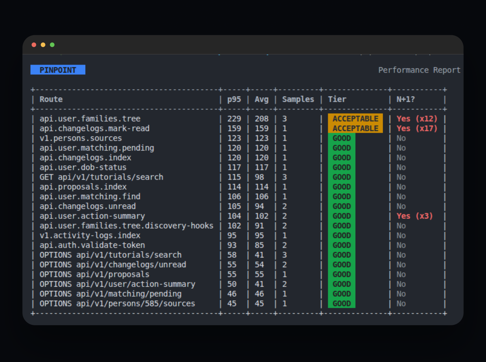

# Pinpoint

[](https://packagist.org/packages/asimali/pinpoint)

**[Explore the Documentation &amp; Features ↗](https://asim-ali-peerzada.github.io/pinpoint)**

Pinpoint is a local-first Laravel request performance profiler. It captures every DB query during a request, detects N+1 patterns, **classifies repeated-query anomalies** (exact-duplicate CACHE vs true N+1), tracks **peak memory per route**, tiers each route (good → critical), and gives you a CLI report that drills from a slow endpoint straight to the offending query and its `caller file:line`.

**Find repeated relationship queries before they become production bottlenecks.** Repeats with identical bindings are flagged **CACHE** (reach for `Cache::remember`); varying bindings are true **N+1s** (reach for eager loading).



Terminal output is rendered with **Termwind** (ships with Laravel): tier pills are color-coded (green / yellow / red), numbers are right-aligned for quick scanning, the **Memory** column flags routes over your budget in red, and N+1/duplicate flags are red/cyan and bold. The design is defined once in `Internal\CliRenderer` and shared by every Pinpoint command.

## Scope & Limitations

- **Is:** a local/dev + limited-staging diagnostics tool for request time, query count, query time, per-route peak memory, and repeated-query analysis (N+1 + exact duplicates).
- **Is not:** an APM replacement, a production-wide trace collector, or a general memory/CPU profiler (use Blackfire for those).

## Installation

```bash
composer require --dev asimali/pinpoint
```

Publish and run the migrations:

```bash
php artisan vendor:publish --tag=pinpoint-migrations
php artisan migrate
```

Optionally publish the config to customize it:

```bash
php artisan vendor:publish --tag=pinpoint-config
```

## Usage

Pinpoint starts recording automatically when enabled. It's **enabled by default when `APP_ENV` is `local`, `development`, `dev`, or `testing`** — zero config needed. `PINPOINT_ENABLED=false` hard-disables it everywhere (e.g. production); `PINPOINT_ENABLED=true` is only needed for non-standard environments like `staging`. Caller file:line capture (`debug_backtrace`) follows the same default in local/dev/testing and can be turned on/off with `PINPOINT_CAPTURE_CALLER`.

## Quickstart (30 seconds)

```bash
# 1. Start clean, then exercise the app — browser, curl, or run your test suite
php artisan pinpoint:reset --force
curl http://localhost:8000/api/orders

# 2. See what was recorded
php artisan pinpoint:report

# 3. Drill into a flagged route (exact queries + caller file:line + suggested fix)
php artisan pinpoint:report --route=api.orders

# 4. Made a fix? Verify it instantly with a time window (see "Fix-verify loop" below)
php artisan pinpoint:report --since=5m
```

### Fix-verify loop (the core workflow)

The report is a **historical aggregate** — it reads every recorded sample, not live traffic. That's deliberate (trends, regressions), but it means **old pre-fix samples keep skewing the numbers after you fix something**: the p95 stays high, `N+1 x14` keeps showing, a 24 MB memory reading lingers. The fix's effect is verified instantly with a time window:

```bash
# before: fix the endpoint however you like, then hit it once
curl http://localhost:8000/api/orders

# after: only look at samples recorded after the fix
php artisan pinpoint:report --since=1m                 # summary, last minute only
php artisan pinpoint:report --route=api.orders --since=1m   # drill-down, fresh only
php artisan pinpoint:reset --force                     # or wipe history entirely
```

`--since` accepts any natural duration — `5` (minutes), `5m`, `5min`, `1h`, `2d`.

## Command reference

| Command                | What it does                                                                                                 | Options                                                                                                                                 | Exit codes                                   |
| ---------------------- | ------------------------------------------------------------------------------------------------------------ | --------------------------------------------------------------------------------------------------------------------------------------- | -------------------------------------------- |
| `pinpoint:report`    | Per-route summary (p50/p95/p99/avg, tier, N+1) + a "Locate" block for the worst offenders                    | `--tier=`, `--route=`, `--since=`, `--limit=`, `--json`, `--json-to=`                                                       | `0` normal, `1` invalid input / DB error |
| `pinpoint:check`     | CI gate: fail the build on N+1s or query/duration budget violations                                          | `--fail-on-n1`, `--fail-on-duplicates`, `--max-queries=`, `--max-duration-ms=`, `--since=`, `--allow-empty`, `--json`, `--json-to=`, `--limit=` | `0` pass, `1` fail                       |
| `pinpoint:snapshot`  | Capture current per-route metrics as a named baseline for later diffs                                        | `--tag=main`, `--since=`, `--no-overwrite`                                                                                                     | `0` success, `1` failure                 |
| `pinpoint:diff`      | Compare current metrics against a baseline snapshot (regression table + detail block)                        | `--baseline=main`, `--since=`, `--fail-on-regression`, `--show-stable`, `--json`, `--json-to=`                                                 | `0` clean, `1` regression/invalid input  |
| `pinpoint:aggregate` | Roll recent raw requests into the `pinpoint_summaries` table (offline percentiles, all-or-nothing per run) | —                                                                                                                                      | `0` success, `1` failure                 |
| `pinpoint:prune`     | Delete recorded data older than the retention window (`pinpoint.retention_days`, default 30)               | `--days=`                                                                                                                             | `0` success, `1` failure                 |
| `pinpoint:reset`     | Wipe ALL recorded data (requests, queries, lazy loads, summaries)                                            | `--force` (skip the confirmation prompt)                                                                                              | `0` success, `1` failure                 |

Local read API (local/debug environments only — blocked by the `LocalOnly` middleware otherwise):

| Endpoint                                            | Returns                                                                                         |
| --------------------------------------------------- | ----------------------------------------------------------------------------------------------- |
| `GET /_pinpoint/api/v1/summaries`                 | Per-route tiers as JSON                                                                         |
| `GET /_pinpoint/api/v1/summaries/{route}/queries` | Top offending queries for one route (URL-encode the route name;`METHOD path` labels work too) |

### More report options

```bash
php artisan pinpoint:report --tier=critical        # only critical routes
php artisan pinpoint:report --since=1h            # only the last hour (5, 5m, 5min, 1h, 2d…)
php artisan pinpoint:report --limit=130            # show more routes (default 20)
php artisan pinpoint:report --json                # machine-readable (scripts / webhooks)
php artisan pinpoint:report --json-to=storage/pinpoint/report.json   # JSON to a file, path printed
```

### What the summary shows

```
PINPOINT                                                             Performance Report

15 route(s) · 2 critical · 5 with N+1 · 2 with duplicate queries

+------------------------------------------+------+------+---------+--------------+--------------+-----------+
| Route                                    | p95  | Avg  | Samples | Memory (peak)| Tier (p95)   | N+1?      |
+------------------------------------------+------+------+---------+--------------+--------------+-----------+
| v1.historical-records.search             | 5872 | 5872 | 1       | 12 MB        |  CRITICAL    | Yes (x3)  |
| api.user.families.tree                   | 258  | 224  | 2       | 6 MB         |  ACCEPTABLE  | Yes (x11) |
| api.changelogs.mark-read                 | 136  | 136  | 1       | 4 MB         |  GOOD        | Yes (x17) |
+------------------------------------------+------+------+---------+--------------+--------------+-----------+
```

> **Each column is an independent signal.** The tier reflects **latency only** (p95 against `thresholds_ms`) — it does *not* factor in N+1s or memory. That's why `api.changelogs.mark-read` shows `GOOD` while carrying `Yes (x17)`: the route responds fast, but 17 near-identical queries per request is still a fixable problem. Read the row as: tier = speed, N+1? = query pattern, Memory = hydration cost. A route is only truly clean when all three are unremarkable.

**Prefer one verdict?** Set `PINPOINT_COMPOSITE_TIER=true` and the column becomes **Health** — `HEALTHY` only when the p95 tier is good/acceptable AND no N+1 AND memory is within budget; anything else shows `NEEDS WORK` followed by its reasons (`NEEDS WORK · N+1`, `NEEDS WORK · MEMORY`, `NEEDS WORK · CRITICAL`, combined with `·`). `--json` rows gain `health` and a `health_reason` breakdown for scripts.

- **Memory** — the **peak RAM the PHP process used while serving the request** (`memory_get_peak_usage(true)`), NOT the size of your response/payload. A 4 MB reading does *not* mean the endpoint returns 4 MB of JSON — it means serving that request made the process allocate up to 4 MB at its worst moment (models hydrated, collections built, big arrays held). Large readings usually mean you're hydrating far more rows than you need — the fix is chunking, `select()` only the columns you use, or cursor-based iteration, not trimming the response body.
  - Each request records its own peak; the report shows the **max** observed across that route's samples.
  - Values over `pinpoint.memory_budget_kb` (default 20 MB; `PINPOINT_MEMORY_BUDGET_KB=10240` for a 10 MB cap, `null`/`-1` disables) are shown bold red.
  - Baseline note: a plain Laravel request typically sits around 2–4 MB. Don't expect 0 MB — read the column as "how far above baseline this route pushes memory," and compare routes against each other rather than against an absolute number.
- **N+1?** — `Yes (xN)` when a repeated query shape runs with **varying** bindings (true N+1, fix with eager loading). `CACHE (xN)` when the repeats use **identical** bindings (cache candidates, fix with `Cache::remember()` — counted separately in the summary line as `with duplicate queries`, and shown in the Locate block as `CACHE xN`). `REPEAT (xN)` when repeats carry **no binding data** (raw SQL — unclassifiable, shown conservatively). All three agree with the `--route` drill-down badges below.

### Drill-down: CACHE vs N+1 badges

`pinpoint:report --route=<route>` classifies each repeated query by its bindings:

- **CACHE xN** (cyan) — same SQL with the same bound values every time → fix with `Cache::remember()` or memoization.
- **N+1 xN** (red) — same SQL shape with different bindings each iteration → fix with `Model::with()`.
- **REPEAT xN** (`unknown`) — no binding data recorded (e.g. raw SQL) → shown conservatively.

A "Duplicate queries detected" block follows the table with the exact `Cache::remember(...)` suggestion for each cache candidate.

### Aggregation (staging/production)

At scale, compute percentiles offline instead of per-request:

```php
// app/Console/Kernel.php
$schedule->command('pinpoint:aggregate')->hourly();
```

```bash
php artisan pinpoint:report --route=api.packages
```

Drilling into a route with lazy-load violations also prints **actionable fixes**, not just warnings:

```text
N+1 detected — suggested eager loads:
  App\Models\CloseoutPackage -> stages.photos at app/Services/ApprovalReadinessService.php:124
  Suggested fix: App\Models\CloseoutPackage::with('stages.photos')
```

**Click to jump to the exact line:** every `file:line` in the report is an OSC 8 terminal hyperlink. Route names in the summary table and the Locate block are links too — Pinpoint resolves each route to its controller action via reflection, so ⌘-clicking a route name jumps straight to the handler method. ⌘-click (macOS) / Ctrl-click (Windows/Linux) works from inside Docker/Sail/WSL because the host terminal resolves the URI scheme, not the container. Default is VS Code (`vscode://file/path:line`); switch to PhpStorm via config:

```php
// config/pinpoint.php
'editor' => 'phpstorm', // or env PINPOINT_EDITOR=phpstorm
```

Any other editor that registers its own URI scheme works too — set `PINPOINT_EDITOR` to its scheme and Pinpoint emits `<scheme>://file/path:line` (e.g. `devin`, `cursor`, `windsurf`). VS Code-compatible forks (Cursor, Windsurf/Devin Desktop) typically register their scheme (or `vscode://`) as the handler; pick whichever your OS opens by default.

The summary table is followed by a **Locate** block showing the top 5 worst offenders (N+1 or critical routes) with their caller line; the rest are listed with a hint to drill in.

Pinpoint persists the model + relation of every lazy-loading violation, chains nested relations (`stages.photos` when `stages` itself is lazily loaded), and shows the exact caller — so the fix is copy-paste ready.

### CI / GitHub Actions — fail the merge on N+1s and query bloat

Pinpoint doubles as a regression gate: run your test suite (requests get recorded), then `pinpoint:check` fails the job when a PR introduces an N+1 or blows a query/duration budget — with the exact offending SQL and `file:line` in the output.

```bash
php artisan pinpoint:check --fail-on-n1 --max-queries=20 --max-duration-ms=1000
```

Exit code is `0` (pass) or `1` (fail) — drop it straight into a workflow:

```yaml
steps:
  - run: php artisan test
  - run: php artisan pinpoint:check --fail-on-n1 --max-queries=20 --json > pinpoint-report.json
  - if: failure()
    uses: actions/github-script@v7
    with:
      script: |
        const fs = require('fs');
        const report = JSON.parse(fs.readFileSync('pinpoint-report.json', 'utf8'));
        core.setFailed(report.violations.map(v =>
          `N+1 in ${v.route}: ${v.sql} at ${v.caller_file}:${v.caller_line} (x${v.repeat_count})`
        ).join('\n'));
```

Options:

- `--fail-on-n1` — fail on true N+1 patterns: same SQL with **varying** bindings, Eloquent lazy-load violations, and repeats with no binding data (cannot be proven safe). Exact duplicates are excluded — they fail only under `--fail-on-duplicates`.
- `--fail-on-duplicates` — fail on exact-duplicate queries (identical bindings, `Cache::remember()` candidates).
- `--max-queries=N` — fail when any request exceeds N queries.
- `--max-duration-ms=N` — fail when any request exceeds N ms.
- `--since=MINUTES` (default 30) — only inspect recent requests; stale rows from previous runs can't false-fail a PR.
- `--allow-empty` — pass (with a warning) when the window contains no requests.
- `--json` — machine-readable `{passed, meta, violations[]}` for PR-comment automation.

Notes for CI:

- **Callers are captured in `testing` and `local` environments** — in CI, run tests with `APP_ENV=testing` so the report includes the exact file:line.
- The check reads raw tables, so it's meant for the **same job that just ran the tests** (fresh data, `--since` guards the window). Use `sample_rate = 1.0` in the CI environment so the gate is deterministic — the command warns if sampling is on.
- **No data in the window → the gate fails closed** (a check that evaluated nothing is a false green). If an empty run is legitimate for your pipeline, add `--allow-empty`.

### Performance regression diff — "did this PR make it slower?"

Two-step workflow: snapshot the baseline on `main`, then diff after your change (run the suite in between so fresh requests are recorded):

```bash
# on main, after exercising the app:
php artisan pinpoint:snapshot --tag=main

# on the PR branch, after running the test suite:
php artisan pinpoint:diff --baseline=main
php artisan pinpoint:diff --baseline=main --fail-on-regression  # exit 1 for CI
```

The table shows every route's status (`REGRESSION` / `IMPROVEMENT` / `STABLE` / `NEW` / `REMOVED`) with baseline vs current p95 and query counts; regressions get a detail block with the exact deltas, the caller file:line, and the suggested fix (`Model::with(...)` for N+1s). Thresholds live in `pinpoint.diff` (`PINPOINT_DIFF_DURATION_PCT=20`, `PINPOINT_DIFF_QUERY_COUNT=3`, `PINPOINT_DIFF_MEMORY_PCT=50`); an introduced N+1 always flags regardless of the count threshold. A route is only judged when both sides have at least `pinpoint.diff.min_samples` samples (`PINPOINT_DIFF_MIN_SAMPLES`, default 1) — raise it in CI so a lone noisy request can't flag a route.

### Configuration reference

All env vars (publish the config for full control: `php artisan vendor:publish --tag=pinpoint-config`):

| Env | Config key | Default | What it does |
|---|---|---|---|
| `PINPOINT_ENABLED` | `enabled` | auto — true when `APP_ENV` is `local`/`development`/`dev`/`testing` | master switch; `false` disables everything, `true` forces on (e.g. staging) |
| `PINPOINT_CAPTURE_CALLER` | `capture_caller` | auto — same environments as above | `debug_backtrace` file:line capture; `true` to force on for staging, `false` to disable even locally |
| `PINPOINT_MEMORY_BUDGET_KB` | `memory_budget_kb` | `20480` (20 MB) | routes whose peak memory exceeds this are flagged red in the Memory column; `null`/`-1` disables the check |
| `PINPOINT_EDITOR` | `editor` | `vscode` | URI scheme for clickable file:line links (`phpstorm`, `cursor`, `windsurf`, `devin`, …) |
| `PINPOINT_COMPOSITE_TIER` | `composite_tier` | `false` | replace the p95-only tier column with a composite Health verdict (`HEALTHY` / `NEEDS WORK · <reasons>`) that factors in N+1 and memory too |
| `PINPOINT_DIFF_DURATION_PCT` / `PINPOINT_DIFF_QUERY_COUNT` / `PINPOINT_DIFF_MEMORY_PCT` | `diff.regression_*` | `20` / `3` / `50` | `pinpoint:diff` regression thresholds (p95 % increase, N+1 count increase, memory % increase) |
| `PINPOINT_DIFF_MIN_SAMPLES` | `diff.min_samples` | `1` | minimum samples on both sides before a route is judged in `pinpoint:diff` |
| — | `sample_rate` | `1.0` | fraction of requests recorded; use `0.1`–`0.2` in staging, keep `1.0` in local and CI |
| — | `n_plus_one_repeat_threshold` | `3` | repeats of a query shape before N+1/duplicate flagging |
| — | `thresholds_ms` | `good: 150, acceptable: 400, needs_improvement: 1000` | tier boundaries (milliseconds) |
| — | `route_threshold_overrides` | — | per-route tier boundaries for endpoints that are naturally slow/fast |
| — | `retention_days` | `30` | window for `pinpoint:prune` |

## Retention

Raw tables grow. Prune old data on a schedule (default retention: 30 days, configurable via `pinpoint.retention_days`):

```php
$schedule->command('pinpoint:prune')->daily();
```

## N+1 detection — how it works and its limits

Two signals:

1. **Lazy-loading violations (semantic):** Pinpoint registers a violation handler that records the model + relation. This is precise but only covers Eloquent relations, and it **chains to any handler already registered before Pinpoint boots**. If your app registers its own `handleLazyLoadingViolationUsing()` in a provider that boots *after* Pinpoint, it will overwrite Pinpoint's handler — in that case, call `Pinpoint::observeLazyLoad($model, $relation)` inside your own handler to keep the signal working. You can disable this signal entirely with `pinpoint.capture_lazy_loading_violations = false`.
2. **Fingerprint repeat count (heuristic):** the same normalized SQL appearing 3+ times (`pinpoint.n_plus_one_repeat_threshold`) in one request is flagged. This catches N+1s done via the raw query builder, but it's a heuristic — a legitimate loop that intentionally runs the same query 3+ times will be flagged. Treat this signal as *likely* N+1, not proof.

Both signals set `has_n_plus_one`; the report shows the repeat count as `Yes (xN)`.

### Repeated-query anomalies: CACHE vs N+1 vs unknown

Fingerprint repeats are not all the same problem — Pinpoint records a normalized hash of the **bound values** alongside each SQL shape and classifies every repeated group by whether the bindings change:

| Classification | Meaning | Suggested fix |
|---|---|---|
| **CACHE** (cyan) | Same SQL with the identical bound values every time — the query result is constant within the request | `Cache::remember(...)` / memoize the result |
| **N+1** (red) | Same SQL shape, different bindings per iteration | eager load with `Model::with(...)` |
| **unknown** | No binding data recorded (e.g. raw `DB::statement` with no params) | drill in and inspect |

The summary line counts both: `53 route(s) · 2 critical · 5 with N+1 · 2 with duplicate queries`. Drill-down (`--route=`) shows a CACHE/N+1/REPEAT pill per repeated query plus the exact `Cache::remember(...)` suggestion for cache candidates. `pinpoint:check --json` exposes `query_type` so CI scripts can branch on the fix automatically.

### Peak memory per route

Every request records its **peak PHP process memory** (`memory_get_peak_usage(true)`) at flush time — the maximum RAM the process allocated while serving that single request, the same figure `memory_get_usage()` tooling reports. This is deliberately **not** the response/payload size: it measures server-side hydration cost (models, collections, query result sets), which is what actually gets your process OOM-killed under load.

The report's **Memory** column shows the max observed across that route's samples and turns bold-red when it exceeds `pinpoint.memory_budget_kb` (default 20 MB, `PINPOINT_MEMORY_BUDGET_KB=10240` for a 10 MB cap, `null` disables the check).

Common causes of a high reading — and the matching fixes:

| Symptom | Likely cause | Fix |
|---|---|---|
| All routes 2–4 MB | normal Laravel baseline | nothing — compare routes against each other |
| One route spikes 20 MB+ | hydrating a huge result set | `->paginate()` / `->limit()`, `select()` only needed columns, `chunkById()` for iteration |
| Growing with request count | accumulating state across requests (Octane/queue) | check for static caches or listeners holding references |

> **Why the column can be non-zero on tiny endpoints:** a bare Laravel request already allocates a few MB (framework boot + middleware). The column is a *comparative* signal: which routes push memory unusually far above that baseline.

## Performance

Measured with `composer benchmark` (in-memory SQLite, 10 queries/request, 200 requests, Testbench skeleton app). DB writes are deferred to the application's `terminating` callbacks — after the response is sent — so the request path only pays for in-memory capture:

| Scenario                        | Mean request time | Overhead |
| ------------------------------- | ----------------- | -------- |
| Pinpoint disabled               | ~0.84 ms          | —       |
| Enabled, no caller capture      | ~1.13 ms          | ~0.29 ms |
| Enabled, local + caller capture | ~1.13 ms          | ~0.29 ms |

The worst case (caller capture via `debug_backtrace`) only runs in local environments — production never pays it. The remaining overhead is one fingerprint hash per query plus the deferred request/query row inserts. Re-run on your own hardware: `composer benchmark`.

## Production guidance

- **Recommended use:** local development, and staging at `sample_rate` 0.1–0.2.
- **Do not** run `sample_rate = 1.0` at high scale — every request inserts rows.
- **Caller capture** (`debug_backtrace`, the most expensive part) only runs in local environments. Disable it everywhere with `pinpoint.capture_caller = false`.
- **Retention:** schedule `pinpoint:prune` (default 30 days) or raw tables grow unbounded.
- **Route grouping:** requests are grouped by `route_name`; requests without a route name fall back to `METHOD path`. If many endpoints share a route name, the summary flattens them — name your routes for useful grouping.
- **Stored SQL is parameterized** — bound values are never persisted (Laravel sends them as `?` placeholders, and Pinpoint stores only the SQL string). The exception is *unparameterized* SQL (`DB::select("... where x = '$value'")`, `whereRaw` with interpolated values): those literals are stored verbatim, so don't pass secrets through string interpolation into raw queries.
- **Local summary computation is in-memory** — `pinpoint:report` and the API read all raw rows to compute percentiles on demand. This is instant at local-dev volumes; for large staging/prod datasets use `pinpoint:aggregate` on a schedule and keep retention tight.

## Troubleshooting

**"No requests recorded yet" — but I've been hitting endpoints.**
Pinpoint is almost certainly disabled. It only records when `pinpoint.enabled` resolves to true, which by default means `APP_ENV` is one of `local`, `development`, `dev`, or `testing`. Check what your app actually thinks: `php artisan about` (Environment line). A custom env name (e.g. `APP_ENV=staging` or a typo like `developement`) silently disables recording — set `PINPOINT_ENABLED=true` in `.env` to enable it regardless of environment. Also verify the tables exist (`php artisan migrate:status | grep pinpoint`); a missing migration only logs a warning, it never throws.

**"I fixed the N+1 / slow route but the report still shows it."**
Expected — the report aggregates **all recorded samples**, so pre-fix rows keep skewing p95, the `Yes (xN)` flag, and the memory column until they age out or are pruned. Verify your fix with a time window: `pinpoint:report --since=5m` (summary or `--route` drill-down), or wipe history with `pinpoint:reset --force`. New fixed requests are recorded instantly — `--since` just excludes the old ones from view.

**"My route shows GOOD but it has an N+1 / high memory — is the tier wrong?"**
No — the tier is labeled `Tier (p95 only)` because it measures **latency alone**. N+1s and memory are tracked in their own columns precisely because a fast route can still be wasteful (a cached-in-memory N+1 answers quickly; 24 MB of hydration can still return in 80 ms). Three independent signals: `Tier (p95)` = speed, `N+1?` = query pattern, `Memory (peak)` = hydration cost. Don't stop at green — scan all three columns.

**"The Memory column shows 4 MB on a route that returns a tiny JSON."**
That's correct — the column is the **peak RAM the PHP process allocated while serving the request**, not the response size. A bare Laravel request has a 2–4 MB baseline; compare routes against each other, not against zero. See [Peak memory per route](#peak-memory-per-route) for causes and fixes.

**"Installed it, ran tests, but `pinpoint:check` finds nothing."**
Two things to check: (1) did your test suite actually make HTTP requests (feature tests via `get()`/`post()` do; pure unit tests don't); (2) the check only inspects the last 30 minutes by default — use `--since=2h` if your run was earlier. If you sample in CI, run with `sample_rate = 1.0` there (the command warns when it sees sampling).

**"Is my database even connected?"**
The package ships with no database of its own — it records into your app's default connection. A fresh `composer create-project` Laravel app uses **SQLite** (`database/database.sqlite` file), which looks like "no database" in GUI tools — point any SQLite browser at that file. Pinpoint's tables (`pinpoint_requests`, `pinpoint_queries`, …) appear inside your existing connection after you publish and run the migrations.

**"Links don't open my editor."**
OSC 8 terminal hyperlinks require a terminal that supports them (iTerm2, VS Code's integrated terminal, Windows Terminal, kitty…). The link uses the `pinpoint.editor` scheme — `vscode` by default, `PINPOINT_EDITOR=phpstorm` for PhpStorm, any custom scheme like `cursor`/`windsurf`/`devin` passes through. From inside Docker/Sail/WSL the host terminal still resolves the link — nothing is executed server-side.

## Testing

```bash
composer test
```

## Changelog

See [CHANGELOG.md](CHANGELOG.md) for recent changes.

## Contributing

Please see [CONTRIBUTING.md](CONTRIBUTING.md) for details.

## Security Vulnerabilities

Report security vulnerabilities privately to `asimalipeerzada@gmail.com`. Please do not open a public issue.

## Credits

- [Asim Ali](https://github.com/asim-ali-peerzada)

## License

The MIT License (MIT). Please see [LICENSE](LICENSE) for more information.
